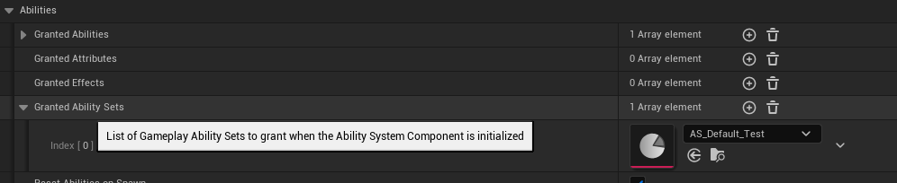
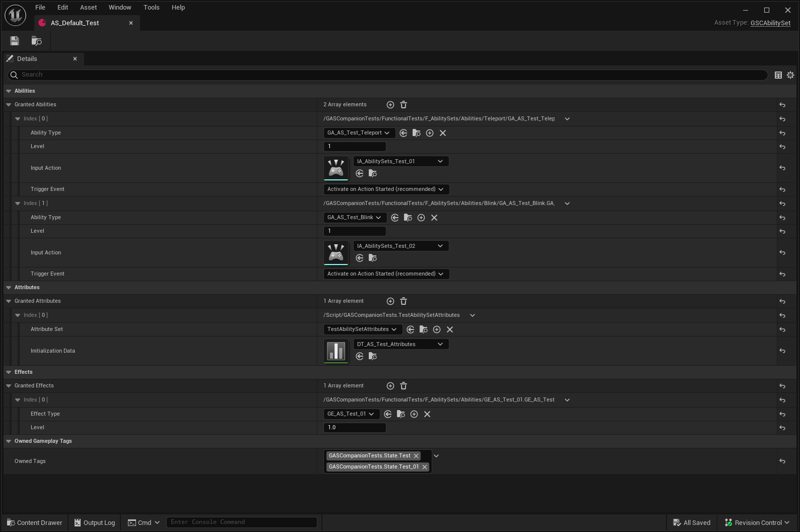

Ability Sets are created from the Content Browser, right clicking to bring up the context menu and choosing `Miscellaneous > Data Asset`, then `GSCAbilitySet` for the parent class.

## Usage

If ability sets need to be granted on spawn, the recommended way to do so is via `Ability Sets` property of `GSCAbilitySystemComponent`.

[](ability_sets_01.png)

Similar to the Granted Abilities / Effects / Attributes properties. Ability Sets are DataAsset that can be used to define and give to an AbilitySystemComponent a set of:
 
- Abilities, with optional enhanced input binding
- Attribute Sets
- Gameplay Effects
- Owned Tags
 
[](ability_sets_02.png)

Please note that for ability input binding to work, the Avatar Actor needs to have the required GSCAbilityInputBinding actor component added to it, otherwise you might see an error in the output log like so:

```
Error trying to grant ability set AS_Default_Test - The set contains Abilities with Input bindings but BP_Character_C_0 is missing the required UGSCAbilityInputBindingComponent actor component.
```

When try to grant an Ability Set with ability bound to an input action on an Actor without GSCAbilityInputBinding actor component.

## API

Below section gives an overview of programmatic usage, when granting Ability Sets during actor initialization is not always suited.

The common pattern of granting / clearing ability sets involves:

1. Calling `GiveAbilitySet()`, returning an handle.
2. Storing the set handle in an internal single variable or array.
3. Calling `ClearAbilitySet()` with the previously stored handle whenever the set needs to be removed.

A typical use case is equipping weapons or equipment. On equip, you would grant and give the set to the actor's ASC (actor equipping the weapon / item). On unequip, you would clear the previously granted set with the previously stored handle.

- `GiveAbilitySet`: Will, in this order, grant any defined **abilities** in the set, then add **attributes**, then apply **effects**, then add **owned tags** as loose gameplay tags.
- `ClearAbilitySet`: Does the inverse. Will, in this order, clear **input binding** (if any), then clear **abilities** and ungrant it when they finishes (if currently active), then remove **effects**, then remove **attributes**.grant any defined **abilities** in the set, then add **attributes**, then apply **effects**, then add **owned tags** as loose gameplay tags.

<div class="notes">

Note: The following methods are exposed via `GSCAbilitySystemComponent` class. You can easily get a reference to it from your actor via `GetCompanionAbilitySystemComponent()` static helper. Available from anywhere, it is equivalent from calling engine's `GetAbilitySystemComponent` (passing in the Avatar Actor - typically your pawn / character), then casting the returned ASC to `UGSCAbilitySystemComponent`, giving you access to `UGSCAbilitySystemComponent` API below.

</div>

### UGSCAbilitySystemComponent::GiveAbilitySet()

**`UGSCAbilitySystemComponent::GiveAbilitySet()` Blueprint callable**

Grants a given Ability Set to the ASC, adding defined Abilities, Attributes, Effects and Owned Tags.

This method is meant to run on both Authority (must be called from server), and on Client if you'd like to setup binding as well (Important to call on client too for Owned Tags)

During Pawn initialization, if you'd like to grant a list of Ability Sets manually with this method, the typical place to do so is:

*   OnInitAbilityActorInfo (event exposed by both UGSCAbilitySystemComponent and UGSCCoreComponent)
*   OnBeginPlay but only if ASC is on the Pawn (not using GSCModularPlayerState to hold the ASC)

Both Player State pawns and non Player State pawns can use OnInitAbilityActorInfo, while only non Player State pawns can use OnBeginPlay to grant the ability.

Also, for input binding to work and register properly, the avatar actor for this ASC must have UGSCAbilityInputBindingComponent actor component.

### UGSCAbilitySystemComponent::ClearAbilitySet()

**Blueprint callable**

Removes the AbilitySet represented by InAbilitySetHandle from the passed in ASC. Clears out any previously granted Abilities, Attributes, Effects and Owned Tags from the set.

Like granting, it is advised to call this method on both Server and Client for multiplayer games.

## Examples

**For non Player State ASC (ASC on Pawn)**

[](./113832-62a49cf2-8264-45a6-8267-6bb2cc2e4aef.png)

[](./113832-9c7f75df-6769-4bce-8bc9-219af87b8708.png)

**For Player State ASC (ASC on PlayerState)**

[](./113832-9fbdc47c-2070-40f3-b36a-b5f94e17f2cd.png)

For Player States ASC, trying to grant on BeginPlay or Possessed won't work on Clients (mostly Input binding will fail)

[](./113832-3155c89d-631f-4042-9b27-4dd66c9baf7b.png)
[](./113832-737273e0-1e1b-4e83-ac79-a8c30c764b0e.png)

**For Single Player Games - ASC on Pawn or PlayerState**

[](./113832-bfb9fd18-29a7-428c-91c4-a3dd57dcc433.png)

## Related

Related Pull Requests

* [#62](/changelog/pull/62)
* [#73](/changelog/pull/73)
* [#79](/changelog/pull/79)