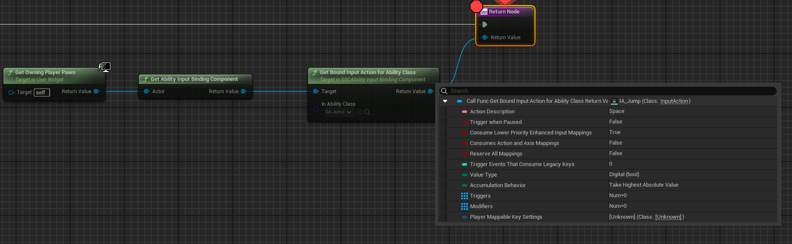

*[on June 25th, 2024](https://github.com/GASCompanion/GASCompanion-Plugin/pull/84)*

## Added GetBoundInputActionForAbilityClass() method for `UGSCAbilityInputBindingComponent`

on `UGSCAbilityInputBindingComponent`, allowing one to grab bound input (if any) out of a Gameplay Ability class.

Also refactored / fixed GetBoundInputActionForAbility to work with either an instantiated ability or its class default object.

***

